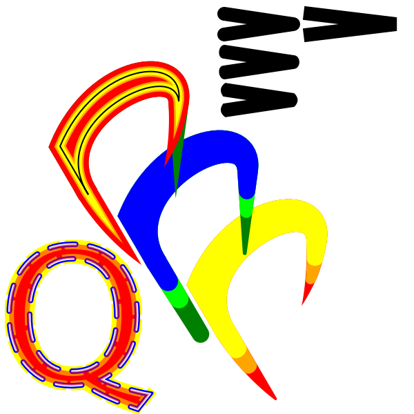
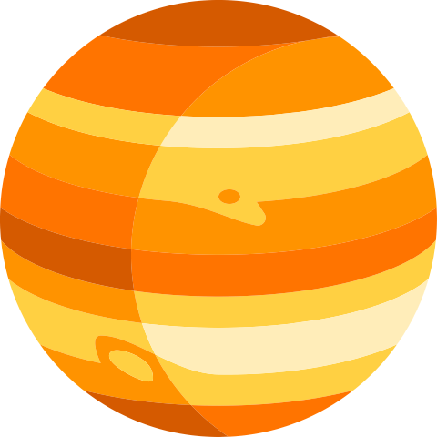
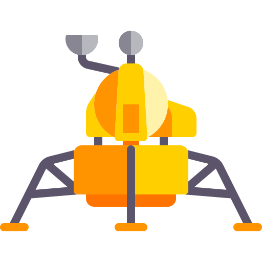
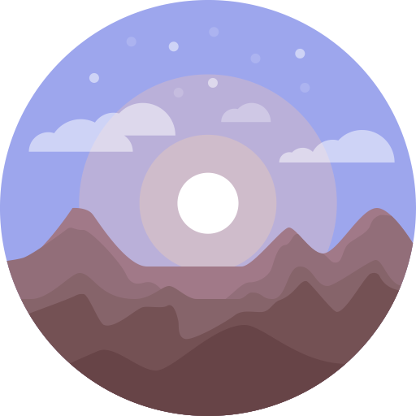

# oksvg
oksvg is a rasterizer for a partial implementation of the SVG2.0 specification in golang.

Although many SVG elements will not be read by oksvg, it is good enough to faithfully produce thousands, but certainly not all, SVG icons available both for free and commercially. A list of valid and invalid elements is in the doc folder.

oksvg uses the [rasterx](https://github.com/srwiley/rasterx) adaptation of the golang freetype raster package which implements full SVG2.0 path functions, including the newer 'arc' join-mode.

### Extra non-standard features.

In addition to 'arc' as a valid join mode value, oksvg also allows 'arc-clip' which is the arc analog of miter-clip and some extra capping and gap values.

#### Rasterizations of SVG to PNG from creative commons 3.0 sources.

Example renderings of unedited open source SVG files by oksvg and rasterx are shown below.

Thanks to [Freepik](http://www.freepik.com) from [Flaticon](https://www.flaticon.com/)
Licensed by [Creative Commons 3.0](http://creativecommons.org/licenses/by/3.0/) for the example shown here icons, and used as test icons in the testdata folder.

